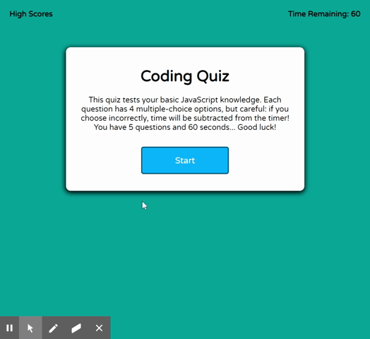

# JavaScript Quiz

## 🎥 Demo

Currently deployed at [GitHub Pages](https://joeldore.github.io/Code-Quiz/)

---
## Description
This project is a timed quiz on the fundamentals of JavaScript. The user has 60 seconds to answer 5 multiple-choice questions. Every correct answer scores the user 10 pts; an incorrect answer will subtract 10 seconds from the timer. When time runs out or all questions are answered, the user may enter their initials to submit their score to a locally stored leaderboard.

---
## Results
* Through this project, I gained an understanding of local storage.
* I learned the importance of pseudo-coding & thoughtfully mapping out logic/structure before starting a project.
* I also expanded my knowledge of CSS and how to create a better UI/UX.

---
## 📝 License
Copyright © 2020 [Joel Dore](https://github.com/JoelDore)  
This project is [MIT](https://github.com/JoelDore/Code-Quiz/blob/main/LICENSE) licensed.

---

