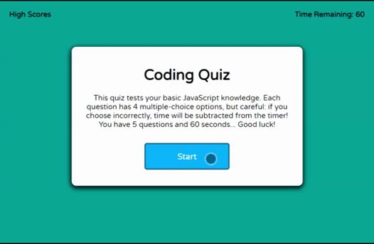

# JavaScript Quiz

Deployed at [GitHub Pages](https://joeldore.github.io/Code-Quiz/)

---

## Description
This project is a timed quiz on the fundamentals of JavaScript that stores high scores. 

---
## 🎥 Demo

## Results
* I gained an understanding of storing data locally
* This project expanded my knowledge of CSS to create a better UI/UX
* I learned the importance of pseudo-coding & thoughtfully mapping out logic/structure instead of diving in blind.

---
## 📝 License
Copyright © 2020 [Joel Dore](https://github.com/JoelDore)  
This project is [MIT](https://github.com/JoelDore/Code-Quiz/blob/main/LICENSE) licensed.

---

